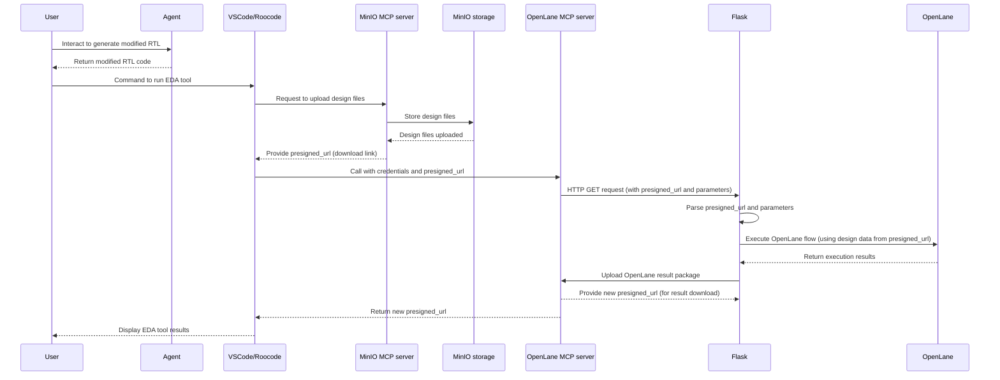

## Deployment Architecture

### Infrastructure Deployment
All infrastructure components are designed to run in Podman containers. While the default configuration assumes that all containers are running on a single Linux instance, you can deploy them on different hosts by modifying the localhost:port settings in each component.

### Agent Deployment
Agents can operate independently and don't need to be on the same host as infrastructure. If you want agents to interact with Roocode, the only requirement is network connectivity to RooCode's HTTP endpoint.

## Repositories
This project is distributed across the following seven repositories:

1.  **[MinIO](https://github.com/mtkresearch/minIO_server)**: Contains the setup and Podman configuration for our private S3 object storage.
2.  **[VS Code with RooCode Extension](https://github.com/mtkresearch/codeserver)**: Provides the customized VS Code (code-server) environment, containerized with Podman. The pre-compiled RooCode extension (`.vsix`) is included.
3.  **[OpenLane Remote MCP Server](https://github.com/mtkresearch/openlane_mcp_server)**: The containerized server that exposes OpenLane 2 functionalities via MCP.
4.  **[OpenLane + Flask Server](https://github.com/mtkresearch/openlane_docker)**: A containerized Flask-based server that provides a higher-level API for interacting with OpenLane.
5.  **[Critical Path Analyzer Agent](https://github.com/mtkresearch/critical_path_analyze_agent)**: The containerized Critical Path Analyzer Agent.
6.  **[Hardware Sharing Agent](https://github.com/mtkresearch/hardware_sharing_agent)**: The containerized Hardware Sharing Agent.
7.  **[RooCode Source Code](https://github.com/mtkresearch/Roo-Code/tree/http_feat)**: The source code for the RooCode VS Code extension. **Note:** You do not need to build or install this repository for setup.

## Getting Started
The installation is divided into two main parts: Infrastructure and Agents.

### Part 1: Infrastructure Setup
To get the core system up and running, please follow the installation steps in the order outlined below. Each step directs you to the relevant repository, which contains detailed instructions for deploying the Podman container.

**Prerequisites:**
- Linux operating system
- Podman installed and configured
- Network connectivity between components (if deploying in distributed mode)

**Step 1: Set Up MinIO Storage**
Start by deploying the MinIO container, which is essential for data management.

➡️ **Installation Instructions**: [MinIO Repository](https://github.com/mtkresearch/minIO_server)

**Step 2: Set Up the OpenLane + Flask Server**
Deploy the container for the Flask server, which provides a high-level API for EDA tool interaction.

➡️ **Installation Instructions**: [OpenLane + Flask Repository](https://github.com/mtkresearch/openlane_docker)

**Step 3: Set Up the OpenLane Remote MCP Server**
Deploy the container for the MCP server, which acts as the bridge to the OpenLane 2 EDA tool.

➡️ **Installation Instructions**: [OpenLane Remote MCP Server Repository](https://github.com/mtkresearch/openlane_mcp_server)

**Step 4: Deploy the VS Code Environment**
Finally, deploy the VS Code (code-server) container. This is your primary interface for the project and comes with the RooCode extension pre-loaded.

➡️ **Installation Instructions**: [VS Code with RooCode Extension Repository](https://github.com/mtkresearch/codeserver)

-----

### Part 2: Agent Installation

  * **Critical Path Analyzer Agent**:
    ➡️ **Installation Instructions**: [Agent Repository](https://github.com/mtkresearch/critical_path_analyze_agent)
  * **Hardware Sharing Agent**:
    ➡️ **Installation Instructions**: [Agent Repository](https://github.com/mtkresearch/hardware_sharing_agent)

Once the infrastructure components are deployed, you can start interacting with the system through the VS Code web interface. The RooCode extension will allow you to connect to the MCP servers and, once the agents are deployed, invoke them to work on your IC design projects. For specific usage instructions and examples, please refer to the documentation within the agent repositories.

## System Workflow Sequence Diagram

While the sequence diagram above shows the user interacting with VS Code/RooCode manually, we have extended the system to support automation via HTTP requests. Specifically, RooCode has been modified to expose port 30005 as an HTTP endpoint.

This allows agents to send POST requests directly to RooCode, mimicking human interactions with the RooCode chatbox interface. 

To enable this capability, you'll need to extend your agent's implementation to generate and send HTTP POST requests to RooCode. Our agent sample implementations already include example code demonstrating how to issue HTTP requests for this purpose.
